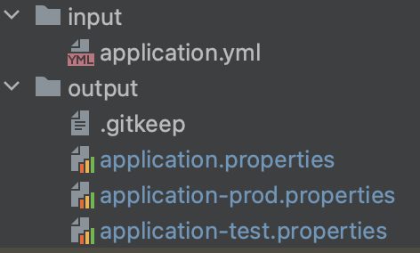

# YAML to Props

What is this tool about?

This is a python script that can be used to generate Spring Framework's `.properties` files from an existing `.yml` file.
It will generate separate `application-{profile}.properties` for each profile.

Spring uses [snakeyaml](https://bitbucket.org/snakeyaml/snakeyaml/issues/561/cve-2022-1471-vulnerability-in) which has CVE-1471 to read Yaml file. 
If we use `.properties` files instead, we can safely exclude snakeyaml dependency.

1. Clone this repo to a safe directory
2. `cd yaml-to-properties`
3. Install dependencies using command: `pip3 install -r requirements.txt`
4. Place your `application.yml` file under `input` directory.
5. Run the command as `python3 main.py`
6. `.properties` file should be under `output` directory.

### Folders after run

### Snakeyaml Removal Process
1. Run `mvn dependency:tree` and see any snakeyaml transitive dependency.
2. Exclude snakeyaml using maven exclusion.
3. Run `mv dependency:tree` again to ensure there's no snakeyaml
4. Run the application to ensure its functional.