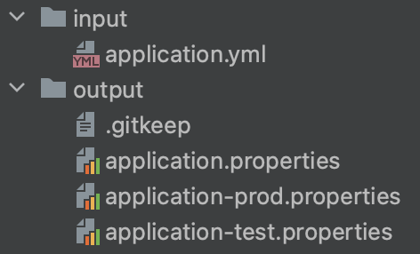

# DuckYAML

Convert your Spring `.yml` configuration to `.properties` files and get rid of [SnakeYAML](https://bitbucket.org/snakeyaml/snakeyaml).

What the duck is this about?

This is a simple Python script that is designed to generate `.properties` files from an existing `.yml` file.
- Since this process involves removing SnakeYAML, make sure your application does not directly use SnakeYAML.
- It will generate separate files for each profile named `application-{profile}.properties`.
- Shared properties are saved to `application.properties` file.
- This is tested for a single `application.yml` file with multiple profiles.

### Background

Spring uses [SnakeYAML](https://bitbucket.org/snakeyaml/snakeyaml) to parse configuration stored in the `.yml` file.
However, SnakeYAML has a track record of having vulnerabilities since 2009 -- checkout it out
on [mvnrepository](https://mvnrepository.com/artifact/org.yaml/snakeyaml)!
Even the recent versions (>= 1.32) have critical vulnerability [(CVE-1471)](https://bitbucket.org/snakeyaml/snakeyaml/issues/561/cve-2022-1471-vulnerability-in). In an enterprise setting, you application could be marked as vulnerable because of this.

Howeer, it doesn't have to be that way. Spring doesn't really need SnakeYAML if `.properties` files are used instead.
This is where the library comes handy.
It automatically creates `.properties` files based on your current `application.yaml` file.

### Steps to use

**Make sure you have Python3 Installed.**

1. Clone this repo to a safe directory.
2. `cd DuckYAML`
3. Install dependencies using: `pip3 install -r requirements.txt`.
4. Place your `application.yml` file under `input` directory.
5. Run the command as `python3 main.py`.
6. Check `output` directory to see your `.properties` files.
7. Copy the properties files to your applications `src/main/resources` directory.
8. Follow the SnakeYAML Removal Process below.

### Folders after script run



### SnakeYAML Removal Process

1. Run `mvn dependency:tree` and see any snakeyaml transitive dependency. It should be under `spring-boot-starter`.
2. Exclude snakeyaml using maven exclusion.
3. Repeat step 1 and 2 until you don't see snakeyaml in the dependency tree.
4. Run the application to ensure its functional.

### Excluding snakeyaml Dependency

```commandline
<dependency>
    <groupId>org.springframework.boot</groupId>
    <artifactId>spring-boot-starter</artifactId>
    <version>${spring-boot.version}</version>
    <exclusions>
        <exclusion>
            <groupId>org.yaml</groupId>
            <artifactId>snakeyaml</artifactId>
        </exclusion>
    </exclusions>
</dependency>
```
